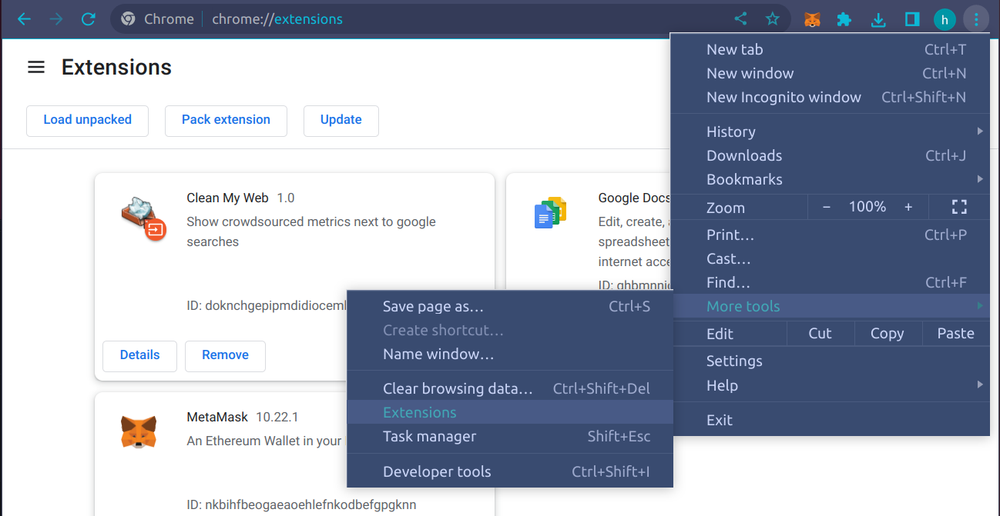

# Clean My Web

# How to install chrome extension

1. Go to the extension menu by typing `chrome://extensions` in the address bar or using the menus.



2. Download the [lastest.crx](clean-my-web-extension/latest.crx) file in the root folder of [clean-my-web-extension](clean-my-web-extension)

3. *Drag* the downloaded file into the extensions tab you opened. It will ask you for confirmation, press yes.


## Demo

### Extension integration with smart contract


### Youtube Link
[https://youtu.be/_kJmJ1EsktA](https://youtu.be/_kJmJ1EsktA)


## App architecture
Smart contract states:
1. **modelParams** (some object type)
2. **urlList** (list of strings)
3. **featureExtractors** (mapping of string to string, first string is the unique name for the features, and second string is a javascript function that takes in raw html and outputs a value)
4. **history** (mapping of hashes to index in data list, last one is the most recent upload)
5. **bestPerformance**

Extension/client states:
1. lastHash (hash of last download/upload)
2. modelParams
3. featureExtractors {‘name’: ‘function’}
4. urlList
5. lastIndex (notes the last of ‘shared’ data’s index)

Smart contract operations:\
**downloadData({hash}) => subset of dataset**\
Example input:
```
{
hash: 0x1xb3d088….
}
```
using hash, only return what the client needs\
**uploadData({newData,newFeatureExtractors}) => index of data in the array (uint)**\
Example input:
```
{
newData: [‘annoyingsite,’url2’,...]
newFeatureExtractors: [‘rawhtml.map(word=> word.includes(keyword))’,’fe2’]
}
```
endpoint to handle upload requests. Call verifyPerformance before making changes to data structure
**verifyPerformance({hash,newData,newFeatureExtractors}) => success (boolean)**\
Example input:
```
{
hash:  0x1xb3d088….
newData: [‘google.com’,’url2’,...]
newFeatureExtractors: [‘rawhtml.map(word=> word.includes(keyword))’,’fe2’]
}
```
query a node.js server somewhere to train a new model on the enhanced dataset and features

Client operations:\
**addData({data}) => none**\
Example input: 
``` 
{
data: annoyingsite.com/v2’
}
```
appends to existing dataset and updates the internal model \
**uploadData({newUrlList,newFeatureExtractors}) => newPerformance, hash**\
Example input: 
``` 
{
newUrlList: [‘annoyingsite.com/v2,’url2’,...],
newFeatureExtractors: [‘rawhtml.count(keyword)’]
}
```
hash is what the smart contract will return, to checkpoint the state.
```
If newPerformance < some threshold + bestPerformance: 
  return false
elif newPerformance >= some threshold + bestPerformance: 
  update lastHash, and also increment lastIndex to the length of uploaded data and update bestPerformance
```
**verifyModel({newUrlList,newFeatureExtractors}): => float**\
Example input: 
``` 
{
newUrlList: [‘annoyingsite.com/v2,’url2’,...],
newFeatureExtractors: [‘rawhtml.count(keyword)’]
}
```
queries a ‘trusted machine’ to build a new model with urlList + newUrlList and featureExtractors + newFeatureExtractors.\
Returns the new performance.\

The smart contract will verify the model using out outside API, probably a node js server to keep things consistent, 
